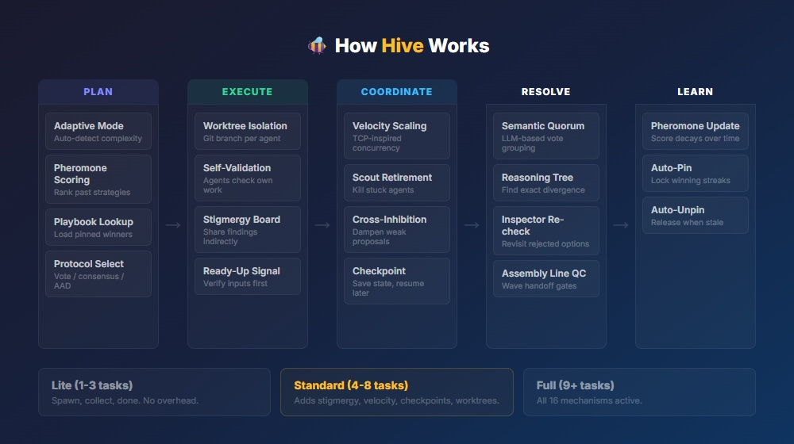

<p align="center">
  
</p>

# Hive: Bio-Inspired Swarm Orchestrator for Claude Code

A drop-in skill that turns Claude Code into a multi-agent swarm. 16 mechanisms from honeybee and ant colony research, backed by 241 tests including adversarial, stress, and A/B comparisons.

## Quick Start

**Install (one command):**
```bash
cp hive.md ~/.claude/commands/hive.md
```

**Use it:**
```bash
/hive research the top 5 competitors in my market
/hive run QA on all test files in this repo
/hive fix all TypeScript errors in src/
```

**Preview before running:**
```bash
/hive --dry-run fix all TypeScript errors in src/
```

**See what's happening under the hood:**
```bash
/hive --verbose fix all TypeScript errors in src/
```

That's it. One file, no dependencies, no server, no setup.

**Note:** Hive agents run as concurrent subprocesses via Claude Code's Agent tool. They execute in parallel but share one API rate limit pool. For large swarms (10+ heavy agents), multi-session tools can distribute load across separate sessions. Hive's strength is coordination quality (conflict resolution, consensus, fault tolerance), not raw throughput.

## What a Run Looks Like

```
> /hive fix all TypeScript errors in src/

Mode: Standard (6 subtasks) | Strategy: wide-parallel | Protocol: vote
Worktree isolation: ON (file-writing detected)

Wave 1 (concurrency: 5, reserve: 1)
  [DONE] Fix src/auth.ts -- 3 errors fixed (38s, HIGH)
  [DONE] Fix src/api.ts -- 1 error fixed (22s, HIGH)
  [DONE] Fix src/utils.ts -- 2 errors fixed (31s, HIGH)
  [DONE] Fix src/models.ts -- 4 errors fixed (45s, MEDIUM)
  [DONE] Fix src/routes.ts -- 1 error fixed (19s, HIGH)

Wave 2 (concurrency: 1)
  [DONE] Synthesize + merge all branches (12s, HIGH)

Result: 11 TypeScript errors fixed across 5 files. 0 conflicts.
Duration: 57s total. Score: 9.2/10
History saved to ~/.claude/hive-history.jsonl
```

<details>
<summary><b>With --verbose: see every mechanism in action</b></summary>

```
> /hive --verbose fix all TypeScript errors in src/

Mode: Standard (6 subtasks) | Strategy: wide-parallel | Protocol: vote
Playbook: 2 pinned strategies loaded (wide-parallel/qa scored 9.2, iterative/fix scored 8.8)
Worktree isolation: ON (file-writing detected)
Context: 23% used | Estimated cost: ~35% for full plan

Wave 1 (concurrency: 5, reserve: 1)
  [DONE] Fix src/auth.ts -- 3 errors fixed (38s, HIGH)
  [DONE] Fix src/api.ts -- 1 error fixed (22s, HIGH)
  [DONE] Fix src/utils.ts -- 2 errors fixed (31s, HIGH)
  [DONE] Fix src/models.ts -- 4 errors fixed (45s, MEDIUM)
  [DONE] Fix src/routes.ts -- 1 error fixed (19s, HIGH)

## Wave 1 Trace
Mechanisms activated: [1] Pheromone, [2] Self-Validation, [4] Stigmergy,
                      [5] Velocity, [15] Adaptive, [16] Worktree
Decisions:
  - Mode: standard (6 subtasks, threshold 4-8)
  - Strategy: wide-parallel (all independent, from pinned playbook)
  - Parallelism: standard tier (ratio 0.52, 5 of 5 launched concurrently)
  - Worktree: ON (detected "fix" keyword, file-writing task)
  - Reserve: 1 of 6 held back
Stigmergy: 11 findings posted across 5 agent files, 0 duplicates
Timing:
  - Fastest agent: 22s (src/api.ts)
  - Slowest agent: 45s (src/models.ts)
  - Velocity: 2.3 completions/min (expected 1.8, action: maintain)
Confidence: chain=0.82, min=0.85 (src/models.ts), avg=0.91
Worktree merges: 5 auto-merged (all >= 0.85), 0 conflicts
Checkpoint: saved to .hive/checkpoints/hive-20260326-1600-wave1.json

Wave 2 (concurrency: 1)
  [DONE] Synthesize + merge all branches (12s, HIGH)

## Learning
Score: 9.2/10 (11/11 passed, no throttles, fast, good stigmergy)
Playbook: wide-parallel/fix scored 9.2 (streak: [8.8, 9.1, 9.2] -- AUTO-PINNED)
History: appended to ~/.claude/hive-history.jsonl (32 entries, pruned 0)
```

</details>

<details>
<summary><b>With --dry-run: preview the plan before spending API calls</b></summary>

```
> /hive --dry-run fix all TypeScript errors in src/

DRY RUN -- no agents will be launched

Mode: Standard (6 subtasks detected)
Strategy: wide-parallel (all tasks independent)
Protocol: vote (reasoning task)
Worktree isolation: ON (file-writing detected)

Plan:
  Wave 1 (5 agents, 1 reserve):
    1. Fix src/auth.ts (model: sonnet, est. 30-45s)
    2. Fix src/api.ts (model: sonnet, est. 20-30s)
    3. Fix src/utils.ts (model: sonnet, est. 25-35s)
    4. Fix src/models.ts (model: sonnet, est. 35-50s)
    5. Fix src/routes.ts (model: sonnet, est. 20-30s)
  Wave 2 (1 agent):
    6. Synthesize + merge (model: opus, est. 10-20s)

Estimated context: ~35% of window
Mechanisms: [1] [2] [4] [5] [15] [16] active, [3] [6] [7] [8] standby
Playbook: 2 pinned strategies available

To execute: /hive fix all TypeScript errors in src/
```

</details>

## Mechanisms in Action

Real scenarios where Hive's biological mechanisms outperform simple "spawn N agents and merge."

<details>
<summary><b>Quorum Sensing resolves a real disagreement</b></summary>

**Scenario:** 5 agents audit a payments module for security issues.

Without Hive (simple merge):
```
Agent 1: "Found SQL injection in processPayment()"
Agent 2: "No SQL injection, but found XSS in renderReceipt()"
Agent 3: "Found SQL injection in processPayment()"
Agent 4: "Code looks clean, no issues"
Agent 5: "SQL injection risk in processPayment(), also XSS in renderReceipt()"

Simple merge: ???  (list all 5 opinions, let the user sort it out)
```

With Hive (Semantic Quorum + Negation-Aware Overlap):
```
Quorum check: grouping 5 conclusions by semantic meaning...
  Group A: "SQL injection in processPayment" — agents 1, 3, 5 (3/5 = quorum)
  Group B: "XSS in renderReceipt" — agents 2, 5 (2/5 = no quorum, flagged)
  Group C: "no issues" — agent 4 (1/5 = outlier, discarded)
  Negation check: agent 4 ("no issues") vs group A ("SQL injection") = DIFFERENT ✓

Result: SQL injection confirmed (quorum). XSS flagged for review (no quorum).
Agent 4's "clean" verdict is correctly identified as an outlier.
```

The quorum mechanism doesn't just count votes. It uses semantic similarity to group "Found SQL injection in processPayment()" and "SQL injection risk in processPayment()" as the same finding, even though the strings are different. And negation-aware overlap catches that "no issues" contradicts "SQL injection" rather than being a partial match.

</details>

<details>
<summary><b>Reasoning Tree finds WHERE agents disagree</b></summary>

**Scenario:** 2 agents refactor an auth module and produce different results.

Without Hive: pick the one with higher confidence, or ask the user.

With Hive (Reasoning Tree Conflict Resolution):
```
Agent A (confidence: 0.88):
  Step 1: Read auth.ts → found JWT validation
  Step 2: Identified token refresh logic → needs refactor
  Step 3: Moved refresh to middleware → cleaner separation
  Step 4: Updated 3 route handlers to use middleware

Agent B (confidence: 0.85):
  Step 1: Read auth.ts → found JWT validation
  Step 2: Identified token refresh logic → needs refactor
  Step 3: Kept refresh inline → added error boundary instead
  Step 4: Updated 3 route handlers with try/catch

Divergence found at Step 3:
  A: "move to middleware"  vs  B: "keep inline, add error boundary"

Challenger (Sonnet) evaluates Step 3:
  "A's middleware approach is more maintainable but changes the call pattern.
   B's inline approach is safer for a refactor (less blast radius).
   Confidence: 0.78 → accept B for refactoring, recommend A for greenfield."

Result: Agent B's approach accepted (lower risk for refactor context).
```

Instead of "Agent A wins because 0.88 > 0.85," the reasoning tree identifies the exact step where they diverge and makes a context-aware decision. The Sonnet challenger costs one cheap API call and saves an Opus escalation ~70% of the time.

</details>

<details>
<summary><b>Velocity scaling prevents rate limit crashes</b></summary>

**Scenario:** 12-task QA run on a large codebase, hitting API rate limits at agent 7.

Without Hive: agents 7-12 all hit 429 errors, retry randomly, some timeout, user gets partial results.

With Hive (Completion Velocity + Checkpoint/Resume):
```
Wave 1 (concurrency: 5, reserve: 2)
  [DONE] Task 1 (22s) [DONE] Task 2 (31s) [DONE] Task 3 (28s)
  [DONE] Task 4 (35s) [DONE] Task 5 (24s)
  Velocity: 2.1/min (expected 1.8) → action: scale up

Wave 2 (concurrency: 7, boosted from velocity)
  [DONE] Task 6 (29s) [DONE] Task 7 (33s)
  [429]  Task 8 — rate limited
  [429]  Task 9 — rate limited

  Rate limit detected → checkpoint saved → concurrency halved to 3 → 30s delay

Wave 3 (concurrency: 3, throttled)
  [DONE] Task 8 (41s) [DONE] Task 9 (38s) [DONE] Task 10 (44s)
  Velocity: 1.1/min → action: maintain (recovering)

Wave 4 (concurrency: 3, stable)
  [DONE] Task 11 (36s) [DONE] Task 12 (32s)

Result: 12/12 tasks completed. 2 rate limits absorbed. 0 lost work.
```

The TCP-inspired velocity control scales UP when things go well (wave 1 was fast, so wave 2 gets more agents), and halves on errors (wave 3 drops to 3). The checkpoint at wave 2 means if the session died, `/hive --resume` would pick up at task 8.

</details>

<details>
<summary><b>Auto-Pin preserves winning strategies across sessions</b></summary>

**Scenario:** Over 5 runs, Hive discovers that `fan-out-gather` works best for research tasks.

```
Run 1: fan-out-gather/research → 7.5/10 (good, not pinned)
Run 2: fan-out-gather/research → 8.2/10 (streak: 1 of 3 needed)
Run 3: fan-out-gather/research → 8.8/10 (streak: 2 of 3)
Run 4: fan-out-gather/research → 9.1/10 (streak: 3 of 3 → AUTO-PINNED)

Pinned strategy now bypasses pheromone decay.
A month later, this strategy still loads first for research tasks.

Run 12: fan-out-gather/research → 5.2/10 (codebase changed significantly)
Run 13: fan-out-gather/research → 4.8/10 (2 consecutive < 6.0 → AUTO-UNPINNED)

Strategy released back to normal decay. Next run will re-evaluate.
```

Without auto-pin, the 9.1/10 strategy from run 4 would score 1.9 after 30 days of pheromone decay, even though it's still the best approach. With auto-pin, it persists until it actually stops working.

</details>

## What It Does

When you run `/hive <task>`, it:

1. **Analyzes** your task and picks the optimal strategy (parallel, pipeline, fan-out-gather, hybrid, iterative)
2. **Plans** subtasks with wave structure, concurrency limits, and reserve capacity
3. **Spawns** agents in parallel with self-validation and shared coordination
4. **Monitors** completion velocity, confidence, and conflicts between waves
5. **Resolves** disagreements by finding the exact reasoning step where agents diverge
6. **Learns** from each run, so the next one is faster and better

## Why This Exists

Most "swarm" prompts are 20 lines that say "spawn N agents and merge results." They don't handle:
- What happens when agents disagree?
- What happens when you hit rate limits mid-swarm?
- What happens when context runs out?
- How do you avoid duplicate work across agents?
- How do you resume after a failure?

Hive handles all of these with mechanisms adapted from real biological research.

## The 16 Mechanisms

<p align="center">
  
</p>

| # | Mechanism | From | What It Solves |
|---|-----------|------|----------------|
| 1 | Pheromone Evaporation | Ant colonies | Old strategies fade, recent ones dominate |
| 2 | Self-Validation | Leaf-cutter ants | Agents check their own work before returning |
| 3 | Reasoning Trees | AgentAuditor paper | Finds WHERE two agents disagree, not just WHO wins |
| 4 | Stigmergy | Ant trails | Agents coordinate through shared findings, not messages |
| 5 | Completion Velocity | Harvester ant TCP | Scales concurrency based on throughput, not just errors |
| 6 | Semantic Quorum | Honeybee nest selection | "Found 3 bugs" and "Three defects" count as agreement |
| 7 | Scout Retirement | Honeybee scouts | Kills stuck agents before they waste your budget |
| 8 | Decision Protocols | ACL 2025 | Vote for reasoning, consensus for knowledge, AAD for creative |
| 9 | Playbook | Ant tandem running | Winning approaches persist across runs |
| 10 | Ready-Up Signal | Bee piping | Pipeline agents verify inputs before doing work |
| 11 | Cross-Inhibition | Bee stop signals | Low-confidence proposals are dampened proportionally |
| 12 | Inspector Agents | Honeybee inspectors | Re-checks previously rejected options if conditions change |
| 13 | Assembly Line QC | Leaf-cutter processing | Wave handoffs serve as quality gates |
| 14 | Checkpoint/Resume | Inspired by LangGraph | Save state, resume with `/hive --resume` |
| 15 | Adaptive Mode | Ant response thresholds | 2-task swarm skips all the heavy mechanisms automatically |
| 16 | Worktree Isolation | Termite chambers | Each agent works in its own git worktree, zero file conflicts |

## Adaptive Mode (Why It's Not Bloated)

The skill auto-detects task size and skips mechanisms that don't help:

- **1-3 tasks (Lite):** Just spawn, collect, synthesize. No pre-flight, no stigmergy, no checkpoints.
- **4-8 tasks (Standard):** Adds pre-flight, stigmergy, checkpoints, velocity scaling, worktree isolation (when writing files).
- **9+ tasks (Full):** Everything active, all 16 mechanisms.

## Worktree Isolation

When agents write code in parallel, they can stomp on each other's files. Hive solves this using git worktrees: each agent gets its own isolated branch. After completion, results are merged back with confidence-weighted conflict resolution.

- Auto-enabled in Standard/Full mode when agents write files
- Force it with `--isolate`
- Falls back to per-agent output files if not in a git repo

## Dry Run

Preview the full execution plan before committing any API calls:

```bash
/hive --dry-run fix all TypeScript errors in src/
```

Outputs: strategy, wave structure, agent count, estimated cost, and which mechanisms will activate. No agents are launched.

A 2-task swarm runs exactly as fast as a basic "spawn 2 agents" prompt. The complexity only activates when it's needed.

## Verbose Mode

See exactly which mechanisms activated and what decisions were made:

```bash
/hive --verbose fix all TypeScript errors in src/
```

Outputs a mechanism trace after each wave: which of the 16 mechanisms fired, timing, confidence scores, and scaling decisions. Useful for understanding what Hive is doing under the hood.

## Test Results

241 tests across 2 test files, all passing:

| Category | File | Tests | What's Covered |
|----------|------|-------|----------------|
| **Prompt compliance** | `hive-prompt-compliance.spec.ts` | **66** | **Parses hive.md itself: verifies all 16 mechanisms, 10 steps in order, thresholds, formulas, flags, agent template, error handling, security, cross-references src/ exports** |
| Core mechanisms | `hive-mechanisms.spec.ts` | 68 | Pheromone decay, quorum, velocity, TTL, scoring, reserve pool, mode detection |
| Worktree isolation | `hive-mechanisms.spec.ts` | 22 | Activation rules, merge decisions, conflict resolution, integration |
| Stress/adversarial | `hive-mechanisms.spec.ts` | 14 | 1000-entry pheromone, NaN, empty arrays, 100-agent conflicts, Unicode |
| Decay variants + auto-pin | `hive-mechanisms.spec.ts` | 13 | Adaptive decay, floor, pinned, auto-pin/unpin lifecycle, 200-trial Monte Carlo |
| Output parsing | `hive-mechanisms.spec.ts` | 7 | Missing fields, unformatted output, empty responses, multiline |
| Negation-aware overlap | `hive-mechanisms.spec.ts` | 5 | "no damage found" vs "damage found" treated as DIFFERENT |
| Checkpoint/Resume | `hive-mechanisms.spec.ts` | 5 | Creation, resume flags, old checkpoint detection |
| Read-only heuristic | `hive-mechanisms.spec.ts` | 4 | Word boundary matching ("address" != "add") |
| Cross-inhibition | `hive-mechanisms.spec.ts` | 3 | Dampening formula, escalation, weight calculation |
| Reserve pool release | `hive-mechanisms.spec.ts` | 3 | Release conditions, error recovery hold, final wave |
| Strategy/protocol | `hive-mechanisms.spec.ts` | 3 | Strategy selection, protocol mapping |
| Zero subtask / edge cases | `hive-mechanisms.spec.ts` | 3 | Direct-answer mode, empty input, single-subtask bypass |

**Why two test files?** `hive-mechanisms.spec.ts` tests the algorithmic logic (math, thresholds, formulas). `hive-prompt-compliance.spec.ts` tests the actual skill file: it parses `hive.md` and verifies every required section, mechanism, threshold, and instruction is present. If someone edits the prompt and accidentally removes a mechanism or breaks a threshold, the compliance tests catch it.

**A/B tested:** Pheromone evaporation vs "just use the most recent run." 100-trial Monte Carlo simulation:

| Metric | Pheromone (0.95/day) | Best-of-Recent (last 3 days) |
|--------|---------------------|--------------|
| Mean selected score | 6.65 | 5.02 |
| Selected a bad strategy (<4) | 3/100 trials | 41/100 trials |
| Recovery from recent bad run | 1 run | Never (locked in) |

The key insight: with variable history, picking the best recent run ignores quality trends beyond a narrow window. Pheromone decay weights the full history with time-appropriate discounting, recovering from a single bad run within one iteration. Test in `tests/hive-mechanisms.spec.ts`, "Monte Carlo" describe block.

**Adversarial tested:**
- Negation near-misses ("no damage found" vs "damage found" correctly treated as DIFFERENT)
- 100 agents all disagreeing (quorum correctly never triggers)
- Unicode edge cases, empty strings, extreme values, NaN inputs

## Research Background

The mechanisms come from peer-reviewed research:
- Thomas Seeley (Cornell): Honeybee nest-site selection and quorum sensing
- Marco Dorigo: Ant Colony Optimization (1992)
- Deborah Gordon (Stanford): Harvester ant TCP-like foraging regulation
- AgentAuditor (2026): Reasoning tree conflict resolution
- Anthropic: 4x5 agent ceiling (max 4 specialists x 5 tasks)
- ACL 2025: Voting vs consensus in multi-agent debate

## Requirements

- [Claude Code](https://claude.ai/code) (any plan with agent support)
- No external dependencies
- No server required
- Works on macOS, Linux, and Windows

## Files

| File | Purpose |
|------|---------|
| `hive.md` | The skill. Copy to `~/.claude/commands/` |
| `src/hive-mechanisms.ts` | Reference implementation of all algorithmic logic |
| `tests/hive-mechanisms.spec.ts` | 175 algorithmic tests importing from `src/` |
| `tests/hive-prompt-compliance.spec.ts` | 66 tests that parse `hive.md` directly |

## Running Tests

```bash
git clone https://github.com/CipherandRow/claude-hive.git
cd claude-hive
npm install
npx vitest run
```

## How It Learns

After each run, Hive records what worked to `~/.claude/hive-history.jsonl`. Next time, it starts with the highest-scoring past configuration.

Records decay at 0.95/day, which means:
- Yesterday's 8/10 run: scores 7.6 (still dominant)
- Last week's 9/10 run: scores 6.4 (fading)
- Last month's 10/10 run: scores 2.1 (nearly gone)

This prevents a single great run from dominating forever, and recovers from a bad run within 1-2 iterations. Tested via 100-trial Monte Carlo simulation (see Test Results).

## Checkpoint/Resume

If a swarm gets interrupted (rate limit, context ceiling, failure), it saves state:
```
CHECKPOINT SAVED: .hive/checkpoints/hive-20260326-1400-wave2.json
To resume: /hive --resume
```

Resume picks up exactly where it left off, with completed results preserved for downstream agents.

## How Hive Compares

| Feature | Hive | [Ruflo](https://github.com/ruvnet/ruflo) (26.9K) | [oh-my-claudecode](https://github.com/Yeachan-Heo/oh-my-claudecode) (12.5K) | [Claude Squad](https://github.com/smtg-ai/claude-squad) (6.6K) | [Claude Octopus](https://github.com/nyldn/claude-octopus) (2.1K) |
|---------|------|------|------|------|------|
| **Setup** | 1 file, 0 deps | Large codebase + install | tmux + config | Go binary + install | Config + 8 providers |
| **Conflict resolution** | Reasoning tree (finds exact divergence point) | Basic merge | None | None | Majority vote |
| **Consensus** | Semantic quorum (LLM-based) | Not documented | Not documented | Not documented | 75% gate (fixed) |
| **Coordination** | Stigmergy (shared board, indirect) | Direct messaging + neural | Shared task list | Session manager | Direct messaging |
| **Isolation** | Git worktree per agent (auto) | Separate processes | tmux sessions (truly parallel) | Separate workspaces | Separate sessions |
| **Learning** | Pheromone decay + playbook | Neural self-learning (more adaptive) | No | No | No |
| **Rate limit handling** | Checkpoint + halve + delay + resume | Retry | Retry | Manual | Retry |
| **Context management** | Ceiling detection + emergency save | Not documented | Not documented | Not documented | Not documented |
| **Observability** | Execution trace (--verbose) | Not documented | Not documented | Not documented | Not documented |
| **Concurrency scaling** | TCP-inspired velocity (auto-tunes) | Fixed | Fixed | Fixed | Fixed |
| **Parallelism** | Concurrent (shared rate pool) | Separate processes | tmux (isolated) | Separate sessions | Multi-provider |
| **Multi-provider** | Claude only | Claude + Codex | Claude + teams | Claude + Codex + Gemini + Aider | 8 providers |
| **Test coverage** | 241 tests | Not publicly documented | Not publicly documented | Not publicly documented | Not publicly documented |
| **Dependencies** | Zero | Many | tmux | Go | Node + config |
| **Community/adoption** | New | 26.8K stars | 12.4K stars | 6.6K stars | 2K stars |

### Where Hive leads

**Algorithmic depth.** No other tool finds the exact reasoning step where agents disagree (Reasoning Trees), uses semantic similarity for quorum instead of string matching, or applies TCP-inspired congestion control to agent concurrency. These aren't marketing features. They're backed by 241 tests and peer-reviewed research.

**Zero setup cost.** Copy one markdown file. That's it. No binary to install, no server to run, no config file to write. Every other tool in this space requires installation steps.

**Adaptive complexity.** A 2-task Hive run is just as fast as a bare "spawn 2 agents" prompt. The 16 mechanisms only activate when the task is complex enough to need them. Other tools apply their full overhead to every run.

**Fault tolerance.** Hive is the only skill that handles rate limits, context exhaustion, and mid-run failures gracefully. Checkpoint/resume means you never lose work. Other tools retry or crash.

### Where others lead

**Session isolation.** oh-my-claudecode and Claude Squad run fully independent Claude Code sessions, each with its own context window and rate limit budget. Hive agents run as concurrent subprocesses but share one orchestrator context and one API rate limit pool. For large swarms where rate limits are the bottleneck, multi-session tools can distribute load across separate accounts.

**Adaptive learning.** Ruflo's neural self-learning adapts to user-specific patterns in ways that static pheromone decay cannot. Pheromone decay is simpler and more predictable, but it doesn't model the user's behavior. If you want a system that gets smarter about YOUR habits specifically, Ruflo's approach is more sophisticated.

**Multi-provider.** Claude Octopus supports 8 LLM providers with cross-model adversarial review (different models check each other's work). Hive is Claude-only. If you use multiple AI providers, Hive is not the right tool.

**Stars and community.** Ruflo has 26.8K stars and thousands of users battle-testing edge cases. Hive is new. Adoption follows visibility, and a larger community means bugs are found and fixed faster.

### When Not to Use Hive

- **Single-file edits.** If your task touches one file, just ask Claude directly. Hive adds overhead for no benefit.
- **Large swarms hitting rate limits.** Hive agents share one API rate limit pool. If you need 10+ heavy agents simultaneously, multi-session tools (oh-my-claudecode, Claude Squad) can distribute load across separate sessions.
- **Multi-provider workflows.** Hive is Claude-only. If you need GPT-4 checking Claude's work, use Claude Octopus.
- **Exploratory conversations.** Hive is for defined tasks with clear subtasks, not open-ended brainstorming.

## Known Limitations

- **No end-to-end tests.** The test suite validates algorithmic logic (pheromone math, threshold decisions, conflict resolution formulas). It cannot test whether Claude follows the prompt correctly during a live run. The `--verbose` flag helps verify mechanism activation manually.
- **TTL is advisory.** Claude Code cannot hard-kill running agents. TTL expiry means late results are discarded, not that the agent is terminated.
- **Shared API pipeline.** Agents are dispatched in parallel but share one API connection. This is a Claude Code platform constraint, not a Hive limitation.

## Porting to Other Platforms

Hive is built for Claude Code, but the algorithms are platform-agnostic. Here's how to port it:

### What's Claude Code-specific (must replace)
| Hive Feature | Claude Code API | What to replace with |
|---|---|---|
| Spawn agents | `Agent` tool with `prompt`, `model` params | Your platform's subprocess/agent spawn API |
| Model selection | `model: "sonnet"` / `"opus"` / `"haiku"` | Equivalent model tiers (fast/smart/cheap) |
| Worktree isolation | `isolation: "worktree"` on Agent tool | Git worktree CLI commands directly |
| Background agents | `run_in_background: true` | Async task queue or shell backgrounding |

### What's platform-agnostic (copy directly)
- Pheromone evaporation formula and history scoring
- Stigmergy (per-agent finding files, wave-boundary merge)
- Adaptive mode detection (Lite/Standard/Full)
- TCP-inspired velocity scaling
- Semantic quorum and negation-aware overlap
- Reasoning tree conflict resolution
- Checkpoint/resume state machine
- Cross-inhibition dampening formula
- Reserve pool allocation and release conditions

### OpenClaw

OpenClaw supports agent spawning via `spawnAcpDirect()`:

```typescript
// Claude Code Agent tool equivalent in OpenClaw:
import { spawnAcpDirect } from 'openclaw/plugin-sdk';

const result = await spawnAcpDirect({
  task: "Your agent prompt here",
  label: "hive-agent-1",
  mode: "run",
  cwd: "/path/to/workspace",
  streamTo: "parent",  // stream output back to orchestrator
}, {
  agentSessionKey: parentSession,
  sandboxed: true,
});
```

Key differences from Claude Code:
- Use `spawnAcpDirect()` instead of the Agent tool
- Use `streamTo: "parent"` + `startAcpSpawnParentStreamRelay()` for real-time output
- Model selection goes in agent config (`resolveAgentConfig`), not per-spawn
- Workspace inheritance via `spawnWorkspaceDir` parameter
- No built-in worktree isolation (use git CLI directly)

### Contributing a port

If you port Hive to another platform, open a PR adding a `ports/` directory with your adapted skill file. Keep the same mechanism numbering so the test suite stays relevant.

## Credits

Built by [John Nowlan](https://github.com/CipherandRow) at [Cipher & Row](https://cipherandrow.com).

Research sources: Seeley (Cornell), Dorigo (ULB), Gordon (Stanford), Anthropic, AgentAuditor.

## License

MIT
